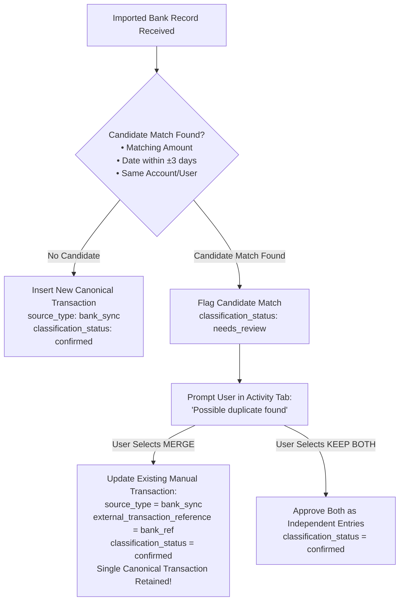

# Opti-Plan Read-Only Bank Sync Architecture

**Date:** August 25, 2026  
**Status:** PHASE 2 ARCHITECTURE AMENDMENT SPECIFICATION  
**Phase:** Phase 2   Technical Architecture  

---

## 1. Executive Summary & Product Boundary

Opti-Plan incorporates read-only bank account connection and transaction synchronization (**Bank Sync**) to allow users to automatically ingest permissioned transaction records from connected financial accounts into their money planner.

### Critical Product & Regulatory Boundaries:
- **Bank Sync (IN SCOPE FOR ARCHITECTURE):** User-consented, read-only transaction and balance synchronization.
- **Auto-Save / Money Movement (EXPLICITLY OUT OF SCOPE / DEFERRED):** Initiating transfers, debits, or holding customer funds. Opti-Plan is NOT a financial custodian, does NOT hold user deposits, and does NOT execute money movements in V1.
- **Single Canonical Financial Model:** Imported bank transactions and manually entered transactions MUST feed the exact same canonical `transactions` ledger. Bank sync does NOT create a competing financial engine.

---

## 2. Provider-Agnostic Adapter Pattern (`BankDataProvider`)

To prevent tight coupling to a single vendor, Opti-Plan architects a provider-agnostic data access boundary:

```
┌────────────────────────────────────────────────────────────────────────┐
│                        PRESENTATION & DOMAIN LAYERS                    │
│    Home • Activity • Plan • Quick Add • Reconciliation Manager          │
└───────────────────────────────────┬────────────────────────────────────┘
                                    │
                                    ▼
┌────────────────────────────────────────────────────────────────────────┐
│                    OPTIPLAN RECONCILIATION ENGINE                      │
│   Canonical Transaction Ingestion • Duplicate Detection • Internal Tx  │
└───────────────────────────────────┬────────────────────────────────────┘
                                    │
                                    ▼
┌────────────────────────────────────────────────────────────────────────┐
│               PROVIDER-AGNOSTIC ADAPTER (`BankDataProvider`)            │
│   startAccountLink() • confirmToken() • listAccounts() • syncData()    │
└───────────────────┬────────────────────────────────┬───────────────────┘
                    │                                │
                    ▼                                ▼
┌──────────────────────────────────────┐  ┌─────────────────────────────┐
│  Nigerian Open Banking (e.g. Mono)   │  │   Future Global Provider    │
└──────────────────────────────────────┘  └─────────────────────────────┘
```

### Conceptual Adapter Interface:
- `startAccountLink(userId: string): Promise<LinkSession>`
- `exchangeToken(publicToken: string): Promise<ConnectionAuth>`
- `listAccounts(connectionId: string): Promise<ExternalAccount[]>`
- `syncTransactions(connectionId: string, cursor?: string): Promise<SyncBatch>`
- `revokeConnection(connectionId: string): Promise<void>`
- `handleWebhook(payload: Buffer, signature: string): Promise<WebhookResult>`

> **Implementation Note:** `[REQUIRES OFFICIAL PROVIDER DOCUMENTATION VERIFICATION BEFORE BANK SYNC IMPLEMENTATION]`   Provider-specific API endpoints, OAuth redirect paths, encryption algorithms, and webhook signatures must be verified against official vendor documentation prior to Phase 9/11 implementation.

---

## 3. Connected Account Data Model (`connected_accounts`)

```sql
CREATE TABLE public.connected_accounts (
    id UUID PRIMARY KEY DEFAULT gen_random_uuid(),
    user_id UUID NOT NULL REFERENCES auth.users(id) ON DELETE CASCADE,
    provider VARCHAR(50) NOT NULL DEFAULT 'mono', -- e.g. 'mono', 'plaid'
    provider_connection_reference TEXT NOT NULL,  // Provider connection/user ID
    provider_account_reference TEXT NOT NULL,     // Provider account ID
    institution_name TEXT NOT NULL,               // e.g. 'GTBank', 'Access Bank'
    account_name TEXT NOT NULL,                   // e.g. 'Salary Savings Account'
    masked_account_identifier VARCHAR(10) NOT NULL, // e.g. '****4321'
    currency_code VARCHAR(3) NOT NULL DEFAULT 'NGN',
    connection_status VARCHAR(20) NOT NULL DEFAULT 'connected' 
        CHECK (connection_status IN ('pending', 'connected', 'syncing', 'requires_reauth', 'disconnected', 'revoked', 'error')),
    consent_granted_at TIMESTAMPTZ NOT NULL DEFAULT NOW(),
    consent_expires_at TIMESTAMPTZ,
    last_successful_sync_at TIMESTAMPTZ,
    last_sync_cursor TEXT,
    created_at TIMESTAMPTZ NOT NULL DEFAULT NOW(),
    updated_at TIMESTAMPTZ NOT NULL DEFAULT NOW(),
    CONSTRAINT uq_provider_account UNIQUE (provider, provider_account_reference)
);

CREATE INDEX idx_connected_accounts_user ON public.connected_accounts(user_id);
```

### What Opti-Plan MUST NEVER Store:
- Internet banking usernames or passwords
- ATM PINs or Transaction PINs
- One-Time Passwords (OTPs) or MFA tokens
- Full 16-digit debit/credit card numbers or CVVs
- Unencrypted provider API secret keys in client tables

---

## 4. Connection Lifecycle States

- **`pending`:** User initiated connection widget; authorization incomplete.
- **`connected`:** Consent active; permissioned read-only sync operational.
- **`syncing`:** Incremental sync in progress.
- **`requires_reauth`:** Provider consent expired or session revoked by bank. User prompt required to re-authenticate.
- **`disconnected`:** User manually disconnected account in Opti-Plan Profile settings. Future syncs stopped.
- **`revoked`:** Bank or provider revoked token.
- **`error`:** Upstream provider API failure.

---

## 5. Extended Canonical Transaction Schema (Imported Provenance)

Bank-imported entries feed the exact same canonical `transactions` table. Provenance metadata is stored directly on the transaction:

```sql
ALTER TABLE public.transactions 
    ADD COLUMN source_type VARCHAR(20) NOT NULL DEFAULT 'manual' CHECK (source_type IN ('manual', 'bank_sync')),
    ADD COLUMN connected_account_id UUID REFERENCES public.connected_accounts(id) ON DELETE SET NULL,
    ADD COLUMN external_transaction_reference TEXT,
    ADD COLUMN provider_reference TEXT,
    ADD COLUMN imported_at TIMESTAMPTZ,
    ADD COLUMN classification_status VARCHAR(20) NOT NULL DEFAULT 'confirmed' CHECK (classification_status IN ('confirmed', 'suggested', 'needs_review'));

-- External Idempotency Constraint
CREATE UNIQUE INDEX uq_external_bank_tx 
    ON public.transactions (connected_account_id, external_transaction_reference) 
    WHERE external_transaction_reference IS NOT NULL;
```

---

## 6. External Transaction Idempotency & Incremental Sync

1. **Uniqueness Invariant:** `UNIQUE(connected_account_id, external_transaction_reference)` guarantees that a bank transaction delivered multiple times by webhooks or polling is imported **EXACTLY ONCE**.
2. **Fingerprint Fallback:** If a provider fails to supply a stable external ID, a deterministic hash is generated:
   $$\text{Fingerprint} = \text{SHA-256}(\text{connected\_account\_id} \mathbin{\Vert} \text{date} \mathbin{\Vert} \text{amount} \mathbin{\Vert} \text{raw\_description})$$
3. **Cursor Checkpoint:** `last_sync_cursor` stores the provider's pagination checkpoint to ensure incremental syncs fetch only new/updated transactions without re-reading full history.

---

## 7. Manual + Bank Duplicate Reconciliation & Merging

When a user manually enters a transaction (`Shoprite ₦20,000`) and the bank later imports `SHOPRITE ₦20,000`, blindly creating a second row would double-count spending (₦40,000).



### Financial Safeguard:
Merging updates the existing manual transaction to gain bank provenance (`source_type = 'bank_sync'`) without creating a second database row. Money Left and total expenses are 100% protected against double counting.

---

## 8. Internal Transfer Handling (Resolved Decision ADR-20)

When a user transfers ₦50,000 from `Account A` to `Account B` (both connected accounts), naively importing both sides creates a ₦50,000 expense on Account A and a ₦50,000 income on Account B. This artificially inflates cash flow while leaving Money Left unchanged.

### Resolution:
1. **New Classification `transfer`:** Added to allowed classifications:
   `CHECK (classification IN ('income', 'expense', 'savings', 'debt', 'transfer'))`
2. **Formula Safeguard:** Internal transfers (`type = 'outflow'`, `classification = 'transfer'`) are **EXPLICITLY EXCLUDED** from Normal Expenses and Income in the Money Left formula:
   $$\text{Money Left} = \text{Total Income} - \text{Normal Expenses} - \text{Savings Contributions} - \text{Debt Repayments}$$
   $$\text{Net Impact of Internal Transfer on Money Left} = \mathbf{0.00}$$
3. **Bank Transfer Fees:** If a transfer incurs a ₦50 fee (`Transfer ₦50,000` + `Fee ₦50`):
   - Principal (₦50,000) $\rightarrow$ `classification = 'transfer'` (Net zero Money Left impact).
   - Fee (₦50) $\rightarrow$ `classification = 'expense'` (Reduces Money Left by ₦50).

---

## 9. Rule-Based Auto-Categorization (Zero AI Dependency)

Imported transaction categorization uses deterministic rule-based merchant string matching:

- `UBER` / `BOLT` $\rightarrow$ Category: `Transport & Fuel` (`classification: expense`)
- `NETFLIX` / `SPOTIFY` $\rightarrow$ Category: `Utilities & Internet` (`classification: expense`)
- `SALARY ACME LTD` $\rightarrow$ Category: `Salary Inflow` (`classification: income`)

### Authority Rule:
Auto-categorization is **ADVISORY**. Suggested categories set `classification_status = 'suggested'`. The user can override categories at any time from the Activity tab.

---

## 10. Consent, Security & Disconnect Rules

1. **Explicit Consent:** Connection requires explicit user authorization via Open Banking widget.
2. **Server-Side Token Storage:** Provider OAuth access tokens and refresh tokens are encrypted at rest using AES-256-GCM and stored in a restricted server database table accessible ONLY by service role. Access tokens are NEVER exposed to browser code or client RLS queries.
3. **Disconnect Behavior:** Disconnecting an account updates `connection_status = 'disconnected'` and revokes provider tokens. Historical canonical transactions created during active consent are RETAINED in the user's timeline (preserving historical financial truth) unless the user explicitly executes *Delete Account Data*.
