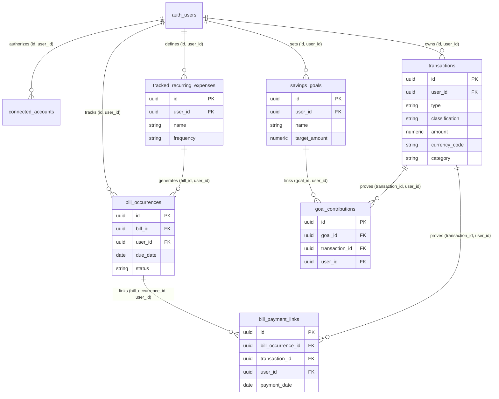

# Opti-Plan Data Architecture

**Date:** August 25, 2026  
**Status:** PHASE 2 DATA ARCHITECTURE SPECIFICATION (REMEDIATED)  
**Phase:** Phase 2   Technical Architecture  

---

## 1. Executive Overview

Financial data correctness is the single most release-critical requirement in Opti-Plan. Users rely on Opti-Plan to accurately understand where their money went, how much they saved, what they paid toward debt, and what remains available to spend.

This document defines the canonical financial model, exact money storage strategy, database schema specifications, referential integrity constraints, entity relationships, bank sync integration, and architectural resolutions for all Phase 2 decisions and remediation requirements.

---

## 2. Exact Money Storage & Currency Strategy

### Selected Strategy: PostgreSQL `NUMERIC(14, 2)` + Client Integer Minor Units

Opti-Plan strictly prohibits IEEE-754 floating-point arithmetic (`0.1 + 0.2 = 0.30000000000000004`) for stored financial data.

1. **V1 Approved Currency Exponent:** Opti-Plan V1 officially supports currencies with **exactly 2 decimal minor units** (e.g. NGN ₦, USD $, GBP £, EUR €). Currencies with non-2-decimal exponents are not supported in V1.
2. **Database Storage Layer (PostgreSQL):**
   - All monetary amounts are stored using PostgreSQL `NUMERIC(14, 2)`.
   - `NUMERIC(14, 2)` supports exact fixed-point decimal values up to $\pm 999,999,999,999.99$ without rounding drift or binary conversion errors.
3. **Client Arithmetic Layer (TypeScript/JS):**
   - In-memory calculations use **integer minor units** (`amount_in_cents = Math.round(amount * 100)`).
   - Locale formatters (`toLocaleString()`) format major currency displays at the UI boundary.

---

## 3. Core Financial Formula & Single Ledger Invariants

Opti-Plan enforces one universal financial formula across all screens:

$$\text{Money Left} = \text{Total Income} - \text{Normal Expenses} - \text{Savings Contributions} - \text{Debt Repayments}$$

### FIND-2-01: Transaction Type / Classification Invariants
Every financial transaction MUST satisfy valid `type` (`inflow`/`outflow`) and `classification` (`income`, `expense`, `savings`, `debt`, `transfer`) pairing:

| Transaction Type | Allowed Classifications | Financial Meaning | Money Left Impact |
| :--- | :--- | :--- | :--- |
| **`inflow`** | `income` | Normal Income Received | **+ Increases Income** |
| **`inflow`** | `transfer` | Incoming Internal Transfer | **0 Net Zero Impact** |
| **`outflow`** | `expense` | Normal Expense Spent | **- Decreases (Expense)** |
| **`outflow`** | `savings` | Savings Contribution | **- Decreases (Savings)** |
| **`outflow`** | `debt` | Debt Repayment | **- Decreases (Debt Paid)** |
| **`outflow`** | `transfer` | Outgoing Internal Transfer | **0 Net Zero Impact** |

#### Prohibited Combinations:
The database engine MUST reject contradictory states (`inflow + expense`, `inflow + savings`, `inflow + debt`, `outflow + income`).

#### Phase 4 SQL Check Constraint Specification:
```sql
CHECK (
    (type = 'inflow'  AND classification IN ('income', 'transfer'))
    OR
    (type = 'outflow' AND classification IN ('expense', 'savings', 'debt', 'transfer'))
)
```

#### Transfer Treatment Rule:
Internal transfers (`classification = 'transfer'`) are **EXPLICITLY EXCLUDED** from Money In, Money Out, Saved, Debt Paid, and Money Left totals. If a transfer incurs a bank fee (e.g. ₦50 fee on ₦50,000 transfer), the fee MUST be logged as its own separate canonical `expense` transaction (`type: outflow`, `classification: expense`, `amount: 50.00`).

---

## 4. Canonical Database Schema Specification

### 4.1 `transactions` (The Single Financial Ledger with Composite Unique Key)

```sql
CREATE TABLE public.transactions (
    id UUID PRIMARY KEY DEFAULT gen_random_uuid(),
    user_id UUID NOT NULL REFERENCES auth.users(id) ON DELETE CASCADE,
    type VARCHAR(10) NOT NULL CHECK (type IN ('inflow', 'outflow')),
    classification VARCHAR(20) NOT NULL CHECK (classification IN ('income', 'expense', 'savings', 'debt', 'transfer')),
    amount NUMERIC(14, 2) NOT NULL CHECK (amount > 0.00),
    currency_code VARCHAR(3) NOT NULL DEFAULT 'NGN',
    category TEXT NOT NULL,
    transaction_date DATE NOT NULL DEFAULT CURRENT_DATE,
    note TEXT,
    created_at TIMESTAMPTZ NOT NULL DEFAULT NOW(),
    updated_at TIMESTAMPTZ NOT NULL DEFAULT NOW(),
    version INTEGER NOT NULL DEFAULT 1,
    client_mutation_id UUID UNIQUE,
    source_type VARCHAR(20) NOT NULL DEFAULT 'manual' CHECK (source_type IN ('manual', 'bank_sync')),
    connected_account_id UUID REFERENCES public.connected_accounts(id) ON DELETE SET NULL,
    external_transaction_reference TEXT,
    provider_reference TEXT,
    imported_at TIMESTAMPTZ,
    classification_status VARCHAR(20) NOT NULL DEFAULT 'confirmed' CHECK (classification_status IN ('confirmed', 'suggested', 'needs_review')),
    -- FIND-2-01: Type / Classification Composite Invariant
    CONSTRAINT chk_tx_type_classification CHECK (
        (type = 'inflow'  AND classification IN ('income', 'transfer')) OR
        (type = 'outflow' AND classification IN ('expense', 'savings', 'debt', 'transfer'))
    ),
    -- FIND-2-04: Relational Ownership Composite Key
    CONSTRAINT uq_transactions_id_user UNIQUE (id, user_id)
);

CREATE INDEX idx_transactions_user_date ON public.transactions(user_id, transaction_date DESC);
CREATE INDEX idx_transactions_classification ON public.transactions(user_id, type, classification);
CREATE UNIQUE INDEX uq_external_bank_tx ON public.transactions(connected_account_id, external_transaction_reference) WHERE external_transaction_reference IS NOT NULL;
```

### 4.2 `connected_accounts`

```sql
CREATE TABLE public.connected_accounts (
    id UUID PRIMARY KEY DEFAULT gen_random_uuid(),
    user_id UUID NOT NULL REFERENCES auth.users(id) ON DELETE CASCADE,
    provider VARCHAR(50) NOT NULL DEFAULT 'mono',
    provider_connection_reference TEXT NOT NULL,
    provider_account_reference TEXT NOT NULL,
    institution_name TEXT NOT NULL,
    account_name TEXT NOT NULL,
    masked_account_identifier VARCHAR(10) NOT NULL,
    currency_code VARCHAR(3) NOT NULL DEFAULT 'NGN',
    connection_status VARCHAR(20) NOT NULL DEFAULT 'connected' 
        CHECK (connection_status IN ('pending', 'connected', 'syncing', 'requires_reauth', 'disconnected', 'revoked', 'error')),
    consent_granted_at TIMESTAMPTZ NOT NULL DEFAULT NOW(),
    consent_expires_at TIMESTAMPTZ,
    last_successful_sync_at TIMESTAMPTZ,
    last_sync_cursor TEXT,
    created_at TIMESTAMPTZ NOT NULL DEFAULT NOW(),
    updated_at TIMESTAMPTZ NOT NULL DEFAULT NOW(),
    CONSTRAINT uq_provider_account UNIQUE (provider, provider_account_reference),
    -- FIND-2-04: Relational Ownership Composite Key
    CONSTRAINT uq_connected_accounts_id_user UNIQUE (id, user_id)
);

CREATE INDEX idx_connected_accounts_user ON public.connected_accounts(user_id);
```

### 4.3 `savings_goals` & `goal_contributions` (FIND-2-04 Composite Relational Ownership)

```sql
CREATE TABLE public.savings_goals (
    id UUID PRIMARY KEY DEFAULT gen_random_uuid(),
    user_id UUID NOT NULL REFERENCES auth.users(id) ON DELETE CASCADE,
    name TEXT NOT NULL,
    target_amount NUMERIC(14, 2) NOT NULL CHECK (target_amount > 0.00),
    target_date DATE,
    currency_code VARCHAR(3) NOT NULL DEFAULT 'NGN',
    status VARCHAR(20) NOT NULL DEFAULT 'active' CHECK (status IN ('active', 'completed', 'archived')),
    created_at TIMESTAMPTZ NOT NULL DEFAULT NOW(),
    updated_at TIMESTAMPTZ NOT NULL DEFAULT NOW(),
    -- FIND-2-04: Relational Ownership Composite Key
    CONSTRAINT uq_savings_goals_id_user UNIQUE (id, user_id)
);

-- FIND-2-04: Junction table with database-enforced Same-User Composite Foreign Keys
CREATE TABLE public.goal_contributions (
    id UUID PRIMARY KEY DEFAULT gen_random_uuid(),
    goal_id UUID NOT NULL,
    transaction_id UUID NOT NULL,
    user_id UUID NOT NULL REFERENCES auth.users(id) ON DELETE CASCADE,
    created_at TIMESTAMPTZ NOT NULL DEFAULT NOW(),
    CONSTRAINT uq_transaction_goal_link UNIQUE (transaction_id),
    -- Database-level Relational Ownership Enforcement:
    CONSTRAINT fk_goal_contrib_goal FOREIGN KEY (goal_id, user_id) REFERENCES public.savings_goals(id, user_id) ON DELETE CASCADE,
    CONSTRAINT fk_goal_contrib_tx   FOREIGN KEY (transaction_id, user_id) REFERENCES public.transactions(id, user_id) ON DELETE CASCADE
);
```

### 4.4 FIND-2-02: `tracked_recurring_expenses` (Bills), `bill_occurrences` & `bill_payment_links`

To support recurring bills across **monthly, weekly, yearly, and custom** schedules without relying solely on a monthly string (`YYYY-MM`), recurring payment identity is architected via explicit **Bill Occurrences**:

```sql
-- Parent Bill Definition Template
CREATE TABLE public.tracked_recurring_expenses (
    id UUID PRIMARY KEY DEFAULT gen_random_uuid(),
    user_id UUID NOT NULL REFERENCES auth.users(id) ON DELETE CASCADE,
    name TEXT NOT NULL,
    expected_amount NUMERIC(14, 2) NOT NULL CHECK (expected_amount > 0.00),
    frequency VARCHAR(20) NOT NULL DEFAULT 'monthly' CHECK (frequency IN ('weekly', 'biweekly', 'monthly', 'yearly', 'custom')),
    due_day_of_month INTEGER CHECK (due_day_of_month BETWEEN 1 AND 31),
    category TEXT NOT NULL,
    currency_code VARCHAR(3) NOT NULL DEFAULT 'NGN',
    is_active BOOLEAN NOT NULL DEFAULT TRUE,
    created_at TIMESTAMPTZ NOT NULL DEFAULT NOW(),
    updated_at TIMESTAMPTZ NOT NULL DEFAULT NOW(),
    -- FIND-2-04: Relational Ownership Composite Key
    CONSTRAINT uq_bills_id_user UNIQUE (id, user_id)
);

-- FIND-2-02: Specific Bill Occurrence Instance (Supports Weekly, Monthly, Yearly)
CREATE TABLE public.bill_occurrences (
    id UUID PRIMARY KEY DEFAULT gen_random_uuid(),
    bill_id UUID NOT NULL,
    user_id UUID NOT NULL REFERENCES auth.users(id) ON DELETE CASCADE,
    due_date DATE NOT NULL,
    expected_amount NUMERIC(14, 2) NOT NULL CHECK (expected_amount > 0.00),
    status VARCHAR(20) NOT NULL DEFAULT 'unpaid' CHECK (status IN ('unpaid', 'paid', 'skipped', 'overdue')),
    period_key VARCHAR(10), -- Optional display period ('YYYY-MM' or 'YYYY-Www')
    created_at TIMESTAMPTZ NOT NULL DEFAULT NOW(),
    CONSTRAINT uq_bill_occurrence UNIQUE (bill_id, due_date),
    -- FIND-2-04: Relational Ownership Composite Key
    CONSTRAINT uq_bill_occurrences_id_user UNIQUE (id, user_id),
    CONSTRAINT fk_bill_occurrence_parent FOREIGN KEY (bill_id, user_id) REFERENCES public.tracked_recurring_expenses(id, user_id) ON DELETE CASCADE
);

-- FIND-2-02 & FIND-2-04: Payment Link Table with Same-User Composite Foreign Keys
CREATE TABLE public.bill_payment_links (
    id UUID PRIMARY KEY DEFAULT gen_random_uuid(),
    bill_occurrence_id UUID NOT NULL,
    transaction_id UUID NOT NULL,
    user_id UUID NOT NULL REFERENCES auth.users(id) ON DELETE CASCADE,
    payment_date DATE NOT NULL DEFAULT CURRENT_DATE,
    created_at TIMESTAMPTZ NOT NULL DEFAULT NOW(),
    CONSTRAINT uq_bill_occurrence_link UNIQUE (bill_occurrence_id),
    CONSTRAINT uq_transaction_bill_link UNIQUE (transaction_id),
    -- FIND-2-04: Relational Ownership Foreign Keys:
    CONSTRAINT fk_bill_payment_occ FOREIGN KEY (bill_occurrence_id, user_id) REFERENCES public.bill_occurrences(id, user_id) ON DELETE CASCADE,
    CONSTRAINT fk_bill_payment_tx  FOREIGN KEY (transaction_id, user_id) REFERENCES public.transactions(id, user_id) ON DELETE CASCADE
);

-- FIND-2-02: Performance Indexes for Recurrence Lookups
CREATE INDEX idx_bill_occurrences_lookup ON public.bill_occurrences(user_id, due_date, status);
CREATE INDEX idx_bill_payment_links_date ON public.bill_payment_links(user_id, payment_date);
```

#### Bill Payment Status Derivation (FIND-2-02):
- A bill occurrence (`due_date`) is evaluated as `paid` if a matching record exists in `bill_payment_links` referencing `bill_occurrence_id`.
- Marking a bill paid prompts the user to log a canonical expense transaction, which links to `bill_occurrences(id)`.
- Deleting the payment transaction automatically cascades to `bill_payment_links`, reverting the bill occurrence status to `unpaid`.

---

## 5. FIND-2-03: Non-Matching Currency History Protection

### Non-Negotiable Currency Rules:
1. **Immutable Historical Currency:** Historical transaction `currency_code` is permanently locked at entry creation.
2. **No Silent FX Conversion:** Opti-Plan V1 does NOT perform real-time FX conversion.
3. **Dashboard Aggregation Isolation:** Home dashboard totals aggregate ONLY transactions that match the profile's active display currency (`currency_code = profile.currency_code`).

### Mandatory Phase 6/7 UX Requirement:
When a user changes their active display currency in Profile (e.g. from NGN to USD) and historical transactions exist in a different currency:
- **Home Dashboard Notice Banner:** The dashboard MUST render an explicit informational banner:
  > *"Displaying USD totals   12 historical entries in NGN are available in Activity."*
- **Prevent Perceived Data Loss:** The user is clearly informed that past records were NOT deleted or converted.
- **Activity Timeline Transparency:** All historical transactions remain fully visible in the Activity timeline, displaying their original currency symbols (`₦50,000 NGN`).

---

## 6. Entity Relationship Diagram (ERD)


