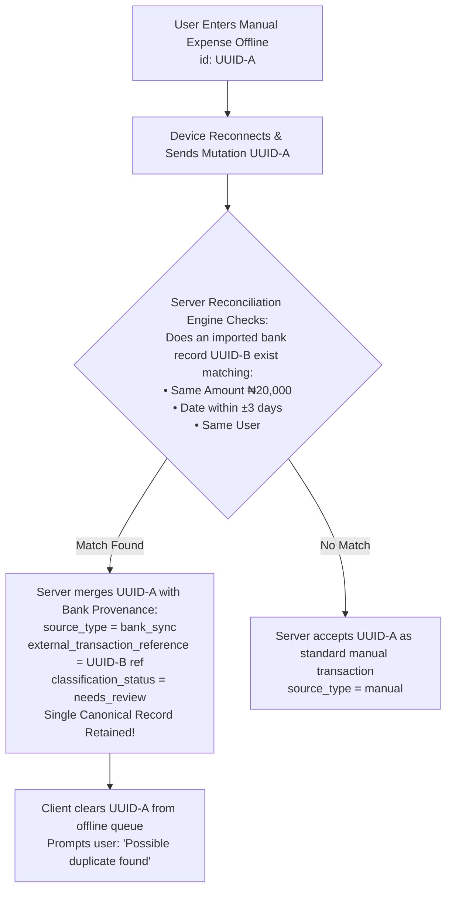

# Opti-Plan Offline & Synchronization Architecture

**Date:** August 25, 2026  
**Status:** PHASE 2 OFFLINE ARCHITECTURE SPECIFICATION (BANK SYNC AMENDED)  
**Phase:** Phase 2   Technical Architecture  

---

## 1. Executive Summary

Opti-Plan is a Progressive Web App (PWA) designed to operate reliably in low-connectivity and offline environments. A user capturing a cash expense on a mobile device must be able to record the transaction instantly, even without an active internet connection.

This document specifies the offline operation scope, local record identity strategy, IndexedDB mutation queue schema, sync lifecycle, bank sync collision handling, and server authority rules.

---

## 2. Mandatory Offline UX Status Communications

| Visual Indicator | Status Label | Meaning & Behavior |
| :--- | :--- | :--- |
| 🟠 Amber Badge | **Saved offline** | Record saved to local IndexedDB queue; awaiting network connection. |
| 🔵 Blue Spinner | **Syncing...** | Network detected; pending mutations are uploading to server. |
| 🟢 Green Check | **Synced** | Trusted database persistence confirmed by Supabase backend. |
| 🔴 Red Alert | **Sync failed** | Server rejected mutation (e.g. auth expired, validation error). User retry available. |

---

## 3. MVP Offline Functional Scope

```
┌────────────────────────────────────────────────────────────────────────┐
│  OFFLINE-WRITE SUPPORTED (Full Capture & Queue)                         │
│  • Quick Add Transactions (Money Out: Expense, Savings, Debt)           │
│  • Quick Add Transactions (Money In: Income)                            │
└────────────────────────────────────────────────────────────────────────┘
┌────────────────────────────────────────────────────────────────────────┐
│  OFFLINE-READ CACHED (IndexedDB Local View)                             │
│  • Recent Activity Timeline & Connected Accounts Cache                  │
│  • Active Monthly Spending Plan & Goals                                 │
└────────────────────────────────────────────────────────────────────────┘
┌────────────────────────────────────────────────────────────────────────┐
│  ONLINE-ONLY OPERATIONS (Network Required)                             │
│  • Bank Account OAuth Authorization & Live Provider Syncing             │
│  • Paystack Subscription Upgrades & Checkout                            │
│  • Account Registration, Login, & Password Reset                        │
└────────────────────────────────────────────────────────────────────────┘
```

---

## 4. Bank Sync + Offline Collision Architecture

### Collision Scenario:
1. User logs a manual expense offline (`Shoprite ₦20,000`, `id: UUID-A`).
2. While the user's device is offline, the connected bank synchronizes a transaction on the server (`SHOPRITE ₦20,000`, `id: UUID-B`).
3. The user's device reconnects to the network and begins uploading the pending offline mutation for `UUID-A`.



### Financial Safeguard:
The server reconciliation engine detects potential collisions during offline mutation upload. Merging assigns bank provenance to the original client UUID without creating a duplicate transaction row or inflating Money Out.

---

## 5. Local Record Identity & Duplicate Prevention (ADR-10)

Client-generated RFC 4122 v4 UUIDs (`crypto.randomUUID()`) serve as stable primary keys for all offline entries. Database check constraints `UNIQUE(client_mutation_id)` and `UNIQUE(connected_account_id, external_transaction_reference)` prevent duplicate records.

---

## 6. Server Authority Principle

- **Client Local State:** Responsive UI preview only.
- **Server PostgreSQL Database:** The single, durable financial truth.
- Local calculation state is immediately overwritten by authoritative server responses upon sync completion.
