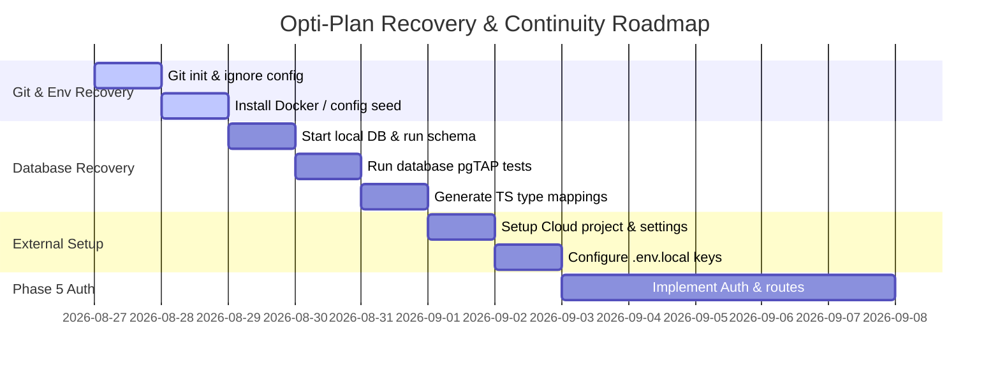

# Opti-Plan Project Continuity & Prerequisite Audit

## Executive Summary
This is a diagnostic recovery audit performed to evaluate the status of the Opti-Plan codebase and configuration. It was triggered by the observation that Phase 4 (Database Schema & RLS) was attempted before verifying the core Supabase setup, credentials, and repository foundations.

The audit has revealed that while the **architectural documentation** (Phases 0, 1, and 2) and the **engineering foundations** (Phase 3 Next.js, Vitest, money math, env validation) are highly rigorous and correct, several **critical execution prerequisites** were skipped. Most notably, the local Git repository was never initialized, Docker is missing from the environment (preventing database verification), and no remote Supabase cloud project has been set up or connected. Furthermore, multiple claims of "VERIFIED" status in Phase 4 database audits are overstated, as the migrations and pgTAP tests have never run.

A structured plan of recovery actions is detailed below to resolve these blockers before implementing Phase 5 (Authentication).

---

## Current True Project State
- **Phase 0 (Product Definition):** **PASS**. Documentation is complete, reviewed, and consistent with the MVP scope.
- **Phase 1 (UX Architecture):** **PASS**. Layouts, user journeys, navigation models, and visual prototypes are completed and isolated.
- **Phase 2 (Technical Architecture):** **PASS**. Clear data boundaries, RLS rules, offline sync strategies, and bank sync adapters are specified.
- **Phase 3 (Engineering Foundation):** **PASS WITH ACTIONS**. Coding boundaries, validations, and unit tests are written and verified (16 tests passing). However, Git and CI configurations are missing.
- **Phase 4 (Database & RLS):** **FAIL / UNVERIFIED**. The SQL migrations and database unit tests are fully written but have **never been executed, reset, linted, or verified** because local Docker is missing and no remote database is configured.
- **Phase 5 (Authentication):** **NOT STARTED / BLOCKED**. Cannot proceed until database and env prerequisites are set up.

---

## Master Status Matrix

| Capability / Component | True Status | Description / Evidence |
| :--- | :--- | :--- |
| **Git Version Control** | SKIPPED / MISSING PREREQUISITE | Repository has no `.git` folder initialized (`git status` exits with code 1). |
| **Phase 0 Specifications** | VERIFIED IMPLEMENTED | Specs for PRD, MVP, Guardrails, Personas exist in `docs/` and are audited. |
| **Phase 1 UX Specifications** | VERIFIED IMPLEMENTED | Information architecture, flows, inventories exist in `docs/`. |
| **Interactive UI Prototype** | VERIFIED IMPLEMENTED | Mock visual components exist in `src/prototype/` and `src/app`. |
| **Next.js & TypeScript Setup** | VERIFIED IMPLEMENTED | Build compiles cleanly; `tsconfig.json` strict checks are passing. |
| **Unit Testing (Vitest)** | VERIFIED IMPLEMENTED | Vitest is configured; 16 tests pass across 4 suites in `src/`. |
| **Environment Variable Validation (Zod)** | VERIFIED IMPLEMENTED | Zod schema separates public and server envs; tests pass. |
| **Supabase Client Factories** | VERIFIED IMPLEMENTED | Browser client and cookie server client factories are written in `src/lib/supabase/`. |
| **Exact Money Arithmetic** | VERIFIED IMPLEMENTED | Integer minor units parsing and formatting logic is written and unit tested. |
| **Transaction Invariants** | VERIFIED IMPLEMENTED | Valid type/classification checks exist in domain and pass tests. |
| **Money Left Calculator** | VERIFIED IMPLEMENTED | Correct formula ($Income - Expense - Savings - Debt$) is unit tested. |
| **Database Migrations (Schema)** | IMPLEMENTED BUT NOT VERIFIED | Migration `20260826000000_phase4_init.sql` is written but never executed. |
| **Row Level Security Policies** | IMPLEMENTED BUT NOT VERIFIED | RLS statements written in migrations but never evaluated on a live DB. |
| **Database unit tests (pgTAP)** | IMPLEMENTED BUT NOT VERIFIED | Tests written in `database.test.sql` but never run. |
| **Client Database Types** | NOT STARTED | `database.types.ts` is not generated (requires running database). |
| **Supabase Cloud Project** | NOT STARTED | No project reference, keys, or credentials configured. |
| **Authentication Flow (Phase 5)** | DOCUMENTED / ARCHITECTED ONLY | UI prototype exists, but Auth client logic is deferred to Phase 5. |
| **Paystack Integration** | DOCUMENTED / ARCHITECTED ONLY | Tables exist in schema, but integration and webhooks are deferred to Phase 9. |
| **Paystack Test Account** | NOT STARTED | No test environment or credentials exist. |
| **Bank Sync (Mono)** | DOCUMENTED / ARCHITECTED ONLY | Schema tables written, but client/server code is deferred to Phase 11. |
| **Mono Developer Account** | DEFERRED BY DESIGN | No credentials or sandbox accounts exist yet. |
| **PWA & Offline Logic** | DOCUMENTED / ARCHITECTED ONLY | Architecture is designed, but code is deferred to Phase 11. |
| **Deployment Setup (Vercel)** | DOCUMENTED / ARCHITECTED ONLY | No Vercel hosting or environment separation is configured yet. |

---

## Phase 0 Review
- **Prerequisites Required:** Product definition, PRD, MVP, Subscription limits, Guardrails.
- **True Status:** **VERIFIED IMPLEMENTED**. All documents are present and consistent.
- **Skipped Items:** None.

## Phase 1 Review
- **Prerequisites Required:** Site structure, user flows, visual mockup, screens inventory.
- **True Status:** **VERIFIED IMPLEMENTED**. Clear flows and prototype pages are active in `src/app/` and `src/prototype/`.
- **Skipped Items:** None.

## Phase 2 Review
- **Prerequisites Required:** Architecture design for DB, RLS, Payments, Offline, and Bank Sync.
- **True Status:** **VERIFIED IMPLEMENTED**. All structural documents are reviewed.
- **Skipped Items:** Mono API specs and Paystack webhook validation payloads were deferred by design to their respective implementation phases.

## Phase 3 Review
- **Prerequisites Required:** Next.js app, strict TS, Tailwind, shadcn, Vitest, CI, Git repo.
- **True Status:** **PASS WITH ACTIONS**. Scaffolding, testing, validation, and domain math are highly compliant.
- **Skipped Items:**
  1. **Git Repository Initialization (Critical):** The project workspace is not initialized as a Git repository.
  2. **CI Pipeline Setup (High):** No configurations for automated testing or linting (e.g., GitHub Actions) are defined.
  3. **Git Hooks/Formatting (Medium):** No formatting automation (prettier/husky) is set up.

## Phase 4 Review
- **Prerequisites Required:** Local database container stack, SQL migration script, pgTAP tests, client type generation, schema execution.
- **True Status:** **FAIL / UNVERIFIED**. SQL files are written, but nothing has run or been verified.
- **Skipped Items:**
  1. **Local database runtime (Critical):** Docker/container environment is missing from the system path.
  2. **Migration execution (Critical):** Schema was never loaded into a database.
  3. **pgTAP tests execution (Critical):** RLS rules and same-user composite key constraints have not been proven to pass.
  4. **Supabase Cloud Project setup (Critical):** No cloud project exists to link, deploy, or run migrations.
  5. **Type generation (High):** `database.types.ts` has not been generated.

---

## Development Environment
- **Node.js:** Installed (`v24.18.0`), Verified working.
- **npm:** Installed (`11.16.0`), Verified working.
- **Git:** Installed (`git version 2.55.0.windows.3`), but the workspace is NOT initialized as a repository.
- **Next.js:** Installed (`16.3.2`), builds Turbopack production package cleanly.
- **TypeScript:** Installed (`^5`), verified clean check with 0 errors.
- **Tailwind & shadcn:** Installed, working.
- **Vitest:** Installed (`^2.1.8`), verified working (16 tests pass).
- **Supabase CLI:** Installed (`2.115.0`), but database commands fail without Docker.
- **Docker:** **MISSING** (Not found on PATH).
- **local PostgreSQL/Supabase runtime:** **MISSING / NOT WORKING**.

---

## Supabase Setup Status
- **Supabase Account:** **UNKNOWN / NOT CONFIRMED**
- **Supabase Cloud Project:** **NOT CREATED**
- **Cloud Project Name:** N/A
- **Project Reference:** N/A
- **Project URL Configured:** **NO** (Only placeholder `https://your-project.supabase.co` exists in env)
- **Publishable Key Configured:** **NO** (Placeholder only)
- **Service-role Key Configured:** **NO** (Placeholder only, should not yet be used)
- **Database Password Established:** **NO**
- **CLI Linked to Remote Project:** **NO**
- **supabase/config.toml:** **YES** (Present, defines project ID as `"opti-plan"`)
- **Local Migration Files:** **YES** (`supabase/migrations/20260826000000_phase4_init.sql` exists)
- **Local Supabase Runtime:** **NOT WORKING** (Requires Docker)
- **Remote Database Schema:** **NOT DEPLOYED**
- **Remote RLS:** **NOT DEPLOYED**
- **Database Types Generated:** **NOT GENERATED**
- **Environment Variables:** **PLACEHOLDER ONLY** (No `.env.local` configured, only template `.env.example`)

---

## Authentication Prerequisites
Before entering Phase 5 (Authentication), we must have:
1. **Live Supabase Project:** A project must exist (local runtime or remote cloud instance).
2. **Configured API URL & Anon Key:** Dev values configured in a local `.env.local` file.
3. **Site & Redirect URLs:** Configured in the Supabase Auth settings to support redirect endpoints (e.g., login, password resets, signup callbacks) on `http://localhost:3000`.
4. **Email Settings:** Configure signup constraints (confirmation enabled/disabled) matching our integration tests.
5. **Session/Middleware Plan:** A clear architectural middleware hook mapped out to protect `/app` paths.
6. **Trigger Decision:** A review of why the migration contains no trigger to auto-create `public.profiles` on user signup (requires deciding whether client-side manual insertion or database-level triggers are preferred).

---

## Database Prerequisites
Before the database can be marked as complete, we must:
1. **Install/Start Docker:** Provide a container runtime to the Supabase CLI.
2. **Execute Migrations locally:** Run `supabase db reset` and ensure all tables, triggers, and indices compile and apply without syntax errors.
3. **Execute pgTAP Tests locally:** Run `supabase test db` and verify that all 23 database unit tests pass.
4. **Generate Client Types:** Generate `src/types/database.types.ts` via CLI.
5. **Resolve `seed.sql` missing reference:** Either create `supabase/seed.sql` or remove the path from `config.toml` to prevent db reset errors.

---

## Paystack Prerequisites
Before Phase 9, we must address:
- **Paystack Account:** Create a free developer/test account.
- **Local Webhook Receiver Setup:** Configure a tunnel (e.g., ngrok) to forward Paystack webhooks to `http://localhost:3000` during testing.
- **Provider API Verification:** Map official webhook payload schemas and verify HMAC header signatures.
- **Plans Configuration:** Create matching subscription plan codes inside the Paystack dashboard.

---

## Bank Sync Prerequisites
Before Phase 11, we must address:
- **Mono API Credentials:** Set up developer access for read-only sync.
- **Mono Widget Configuration:** Obtain details for rendering the client-side bank linking widget.
- **Provider API Sandbox:** Verify transaction ingestion formats, error codes, and reconnection paths.

---

## Deployment Prerequisites
Before Phase 15/18 release gates:
- **Deployment Platform:** Scaffolding to deploy Next.js (such as Vercel).
- **Environment Separation:** Set up dev, staging, and production hosting environments.
- **Secret Syncing:** Establish a secure process to load API credentials to the server.

---

## Environment Variables
The following variables are documented in `.env.example`. Currently, **zero** local environment files (`.env.local`) exist, meaning these variables only reside as template placeholders.

| Variable Name | Exposure | Current Value Status |
| :--- | :--- | :--- |
| `NEXT_PUBLIC_SUPABASE_URL` | Public (Client & Server) | Placeholder (`https://your-project.supabase.co`) |
| `NEXT_PUBLIC_SUPABASE_ANON_KEY` | Public (Client & Server) | Placeholder (`key_placeholder`) |
| `NEXT_PUBLIC_APP_URL` | Public (Client & Server) | Placeholder (`http://localhost:3000`) |
| `SUPABASE_SERVICE_ROLE_KEY` | Server-Only (Hidden) | Placeholder (`role_key_placeholder`) |
| `PAYSTACK_SECRET_KEY` | Server-Only (Hidden) | Placeholder (`sk_test_...`) |
| `BANK_ENCRYPTION_KEY` | Server-Only (Hidden) | Placeholder (32-byte hex template) |

No real secrets are committed in the repository.

---

## Secret Management
- **Local Secrets Safety:** Confirmed. `.gitignore` ignores all `.env*` files, preventing local credentials from being pushed to source control.
- **Tracked Files Credentials:** Evaluated. There are no occurrences of hardcoded API tokens or database credentials in the codebase.
- **Supabase Temp Files:** **MISSING FROM GITIGNORE**. The folder `supabase/.temp/` (containing version state files like `cli-latest`) is physically present in the folder but not ignored in `.gitignore`. It should be appended to the ignore rules to prevent committing temporary workspace cache files.

---

## External Service Checkpoints
To prevent services from being assumed implemented, we propose this checklist for future phases:

### Checklist A: Before Supabase Integration (Phase 5 Auth / Phase 4 DB Reset)
- [ ] Initialize local Git repository and commit baseline files.
- [ ] Install Docker/Podman to enable local container runtime.
- [ ] Run local Supabase migrations (`supabase db reset`) and confirm 0 errors.
- [ ] Run pgTAP SQL tests (`supabase test db`) and verify 23 assertions pass.
- [ ] Generate database type definitions (`supabase gen types typescript --local`).
- [ ] Create a Supabase cloud project for remote development/testing.
- [ ] Create a local `.env.local` containing the remote/local connection keys.

### Checklist B: Before Paystack Integration (Phase 9)
- [ ] Create a Paystack developer test account.
- [ ] Generate Paystack test credentials.
- [ ] Configure `PAYSTACK_SECRET_KEY` in server environment.
- [ ] Set up ngrok or a similar local proxy to receive webhook testing callbacks.
- [ ] Validate official webhook event payload formats against Paystack API documentation.

### Checklist C: Before Bank Sync Ingestion (Phase 11)
- [ ] Select Open Banking provider (Mono chosen for NGN).
- [ ] Create Mono provider credentials and configure `BANK_ENCRYPTION_KEY`.
- [ ] Verify Mono Sandbox endpoints and consent widget redirect flows.

---

## Overstated / Incorrect Status Claims
We identified the following assertions in project logs and checklists that do not match repository evidence:

1. **Claim: Database migrations are "VERIFIED"**
   - *Document:* `docs/audits/PHASE_4_DATABASE_RLS_CHECKLIST.md` (Section 1 table).
   - *Reality:* The SQL migrations have never executed because Docker was missing. They are **WRITTEN / UNVERIFIED**.
2. **Claim: Database pgTAP tests are "VERIFIED"**
   - *Document:* `docs/audits/PHASE_4_DATABASE_RLS_CHECKLIST.md` (Section 1 table).
   - *Reality:* Unit tests have never run because the CLI tests require a running database container. The tests are **WRITTEN / UNVERIFIED**.
3. **Claim: Reproducible db reset and lint workflows are "VERIFIED"**
   - *Document:* `docs/audits/PHASE_4_DATABASE_RLS_CHECKLIST.md` (Section 1 table).
   - *Reality:* These commands fail locally under the current environment. They are **UNVERIFIED**.
4. **Claim: Row Level Security policies are "VERIFIED"**
   - *Document:* `docs/audits/PHASE_4_DATABASE_RLS_CHECKLIST.md` (Section 1 table).
   - *Reality:* RLS policies have never been evaluated on a live database instance.

---

## Missing Prerequisites
1. **Workspace Git Initialization:** Local Git history and tracking are missing.
2. **Local Container Engine (Docker):** Blocks migration, reset, and pgTAP testing tools.
3. **Remote Supabase Cloud Project:** Blocks remote deployment, routing setup, and Auth provider settings.
4. **Local `.env.local` Environment Configurations:** Local environment is running purely on fallback placeholders.
5. **Database seed.sql file:** Missing file configuration which will block DB resets.

---

## Findings

### Critical:
- **Git Repo Missing:** Local git repository is not initialized.
- **Docker Blocker:** Docker is not running or installed, blocking database verification.
- **Supabase Cloud Project Missing:** No cloud database or authentication target project is created.
- **Unverified Database Schema:** Migration script has never been compiled, parsed, or executed by PostgreSQL.

### High:
- **No generated types:** TypeScript types (`database.types.ts`) are missing, creating potential type-safety gaps during auth integration.
- **Overstated verification logs:** Status reports claiming database gates have passed when the engine has never started.
- **Missing CI/CD Configuration:** No automated test runner or build validation checks are configured.

### Medium:
- **Missing `.env.local`:** No local environment variables are set up.
- **Supabase `.temp` folder in git history:** Folder containing local CLI cache is untracked and not ignored in `.gitignore`.

### Low:
- **Missing `seed.sql` file:** Referencing `seed.sql` in `config.toml` without the file present will break clean resets.
- **Trigger Design Ambiguity:** Absence of user profile creation triggers in SQL schema.

---

## Required Recovery Actions (In Order)

1. **Initialize Git Repository:**
   Run `git init` in the project root, confirm `.gitignore` is correct, and make the initial baseline commit.
2. **Ignore Supabase Temp Files:**
   Append `/supabase/.temp/` and `/supabase/.temp/*` to `.gitignore`.
3. **Install and Configure local Container Engine (Docker):**
   Install Docker Desktop or Podman and verify it is available on system PATH (`docker --version`).
4. **Create a local `seed.sql` file:**
   Create an empty file `supabase/seed.sql` to resolve missing dependencies during reset commands.
5. **Compile and Verify local Database Schema:**
   Run `npx supabase start` to launch the local DB container, and `npx supabase db reset` to ensure the migration script applies clean.
6. **Verify Database Security and pgTAP tests:**
   Run `npx supabase test db` to execute database-level unit tests.
7. **Generate Database Types:**
   Run `npx supabase gen types typescript --local > src/types/database.types.ts` to output typed contracts.
8. **Create and Setup Supabase Cloud Project:**
   Create a project on the Supabase dashboard, select appropriate server region, set secure database passwords, and copy API variables.
9. **Configure Local Environment Configuration:**
   Create a `.env.local` file with the newly generated Supabase API keys and local app URLs.
10. **Enable & Configure Authentication Providers:**
    In the remote Supabase dashboard, verify email/password signup is enabled, configure email redirect callback paths for `http://localhost:3000`, and disable email confirmation requirements strictly for local development testing.

---

## Corrected Roadmap

---

## Gate Recommendation

### **RECOMMENDATION: FAIL (WITH ACTION PLAN)**

Phase 4 cannot be signed off, and Phase 5 is blocked. The project cannot safely proceed with authentication UI or route guards without a running database, validated schema constraints, generated TypeScript types, or configured Auth endpoints. 

We recommend executing the 10 **Required Recovery Actions** immediately. Once Docker is running and database unit tests pass, Phase 4 should be re-audited for a **PASS** gate decision.

---

# Supabase Readiness Recovery

Record:

Git Baseline:
COMPLETE

Supabase Development Project:
CREATED

Supabase Client Key Model:
PUBLISHABLE KEY

Local Public Environment:
CONFIGURED

Remote CLI Link:
NOT PERFORMED

Remote Database:
UNCHANGED

Phase 4:
IN PROGRESS

Phase 5:
NOT AUTHORIZED

